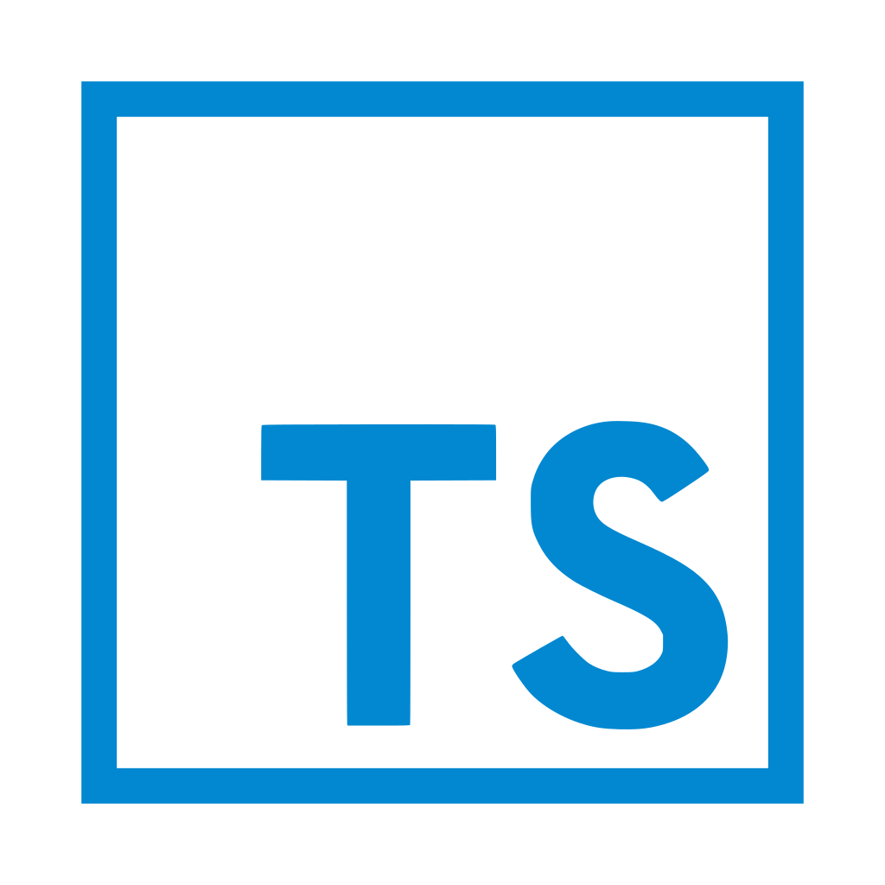
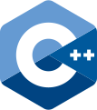
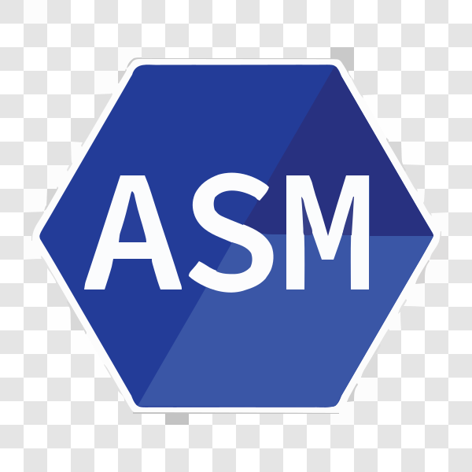
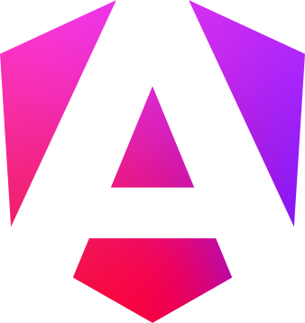
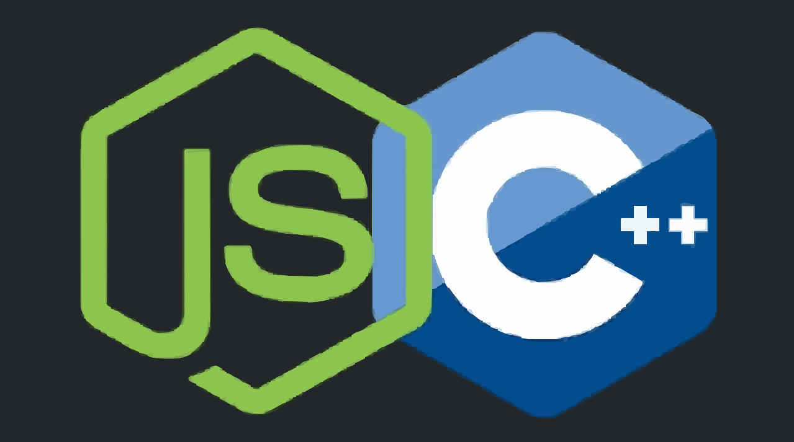
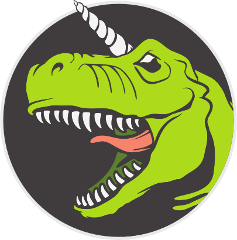
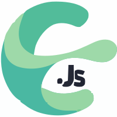

# Teddy Xiong Here 👋

## About Me

a Maker, System designers, Software engineers, Information security researchers and innovative educators.

If you are interest about my research, here is my [Blog](https://teddy1565.github.io), not often updte.

    
    

    

    

<!--

-->

## Skills

|  |  |  |  |  |  |  |  |  |  |  |
| :---------------: | :---------------: | :---------------: | :---------------: | :---------------: | :---------------: | :---------------: | :---------------: | :---------------: | :---------------: | :---------------: |
| Typescript | C | C++ | Assembly | Python | Angular | Electron | Node-API | Libuv | V8 | CornerstoneJS |

---

<a href="https://github.com/teddy1565#gh-dark-mode-only">
    <table cellspacing="0" cellpadding="0">
        <tr>
            <td style="border: 0;">
                
            </td>
            <td style="border: 0;">
                
            </td>
        </tr>
    </table>
</a>

<!--
**teddy1565/teddy1565** is a ✨ _special_ ✨ repository because its `README.md` (this file) appears on your GitHub profile.

Here are some ideas to get you started:

- 🔭 I’m currently working on ...
- 🌱 I’m currently learning ...
- 👯 I’m looking to collaborate on ...
- 🤔 I’m looking for help with ...
- 💬 Ask me about ...
- 📫 How to reach me: ...
- 😄 Pronouns: ...
- ⚡ Fun fact: ...
-->
