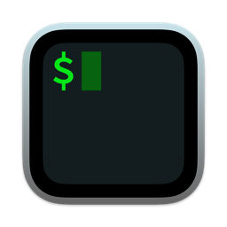

# Teddy Xiong Here 👋

## About Me

a Maker, System designers, Software engineers, Information security researchers and innovative educators.

If you are interest about my research, here is my [Blog](https://teddy1565.github.io), not often updte.

## Languages

|  |  |  |  |  |
| :---------------: | :---------------: | :---------------: | :---------------: | :---------------: |
| Typescript | C | C++ | Assembly | Python |

## Frameworks & Libraries

|  |  |  |  |  |  |
| :---------------: | :---------------: | :---------------: | :---------------: | :---------------: | :---------------: |
| Angular | Electron | Node-API | Libuv | V8 | CornerstoneJS |

## Technologies

<table style="height: 30vh; width: 100%;">
    <tr>
        <td valign="top" style="width: 25%;">
            <h3>Common Skills</h3>
            

                
                    
                
                NodeJS
            

            

                
                    
                
                Git
            

            

                
                    
                
                Linux
            

            

                
                    
                
                Shell Script
            

            

                
                    
                
                Terminal
            

        </td>
        <td valign="top" style="width: 25%;">
            <h3>Database</h3>
            

                
                    
                
                PostgreSQL
            

            

                
                    
                
            

            

                
                    
                
                MySQL
            

        </td>
        <td valign="top" style="width: 25%;">
            <h3>Virtualization & Containerization</h3>
            

                
                    
                
                Docker
            

            

                
                    
                
                Kubernetes
            

            

                
                    
                
                VMware vSphere
            

            

                
                    
                
                Containerd
            

            

                
                    
                
                OCI
            

        </td>
    </tr>
</table>

---

<table style="height: 30vh; width: 100%;">
    <tr style="height: 100%; width: 100%;">
        <td valign="top" style="width: 50%; height: 100%; padding: 3%;">
            
        </td>
        <td valign="top" style="width: 50%; height: 100%; padding: 2%;">
            
        </td>
    </tr>
    <tr>
        <td>
        
        
        </td>
        <td>
            
        </td>
    </tr>
</table>

<!--
**teddy1565/teddy1565** is a ✨ _special_ ✨ repository because its `README.md` (this file) appears on your GitHub profile.

Here are some ideas to get you started:

- 🔭 I’m currently working on ...
- 🌱 I’m currently learning ...
- 👯 I’m looking to collaborate on ...
- 🤔 I’m looking for help with ...
- 💬 Ask me about ...
- 📫 How to reach me: ...
- 😄 Pronouns: ...
- ⚡ Fun fact: ...
-->
